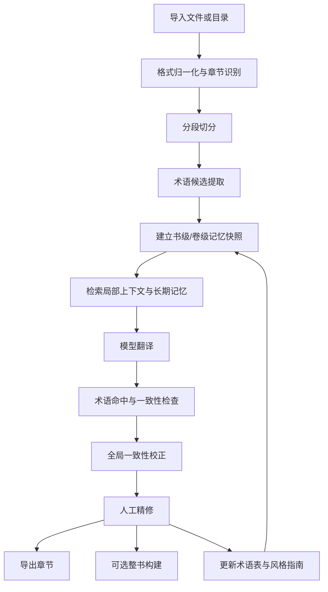
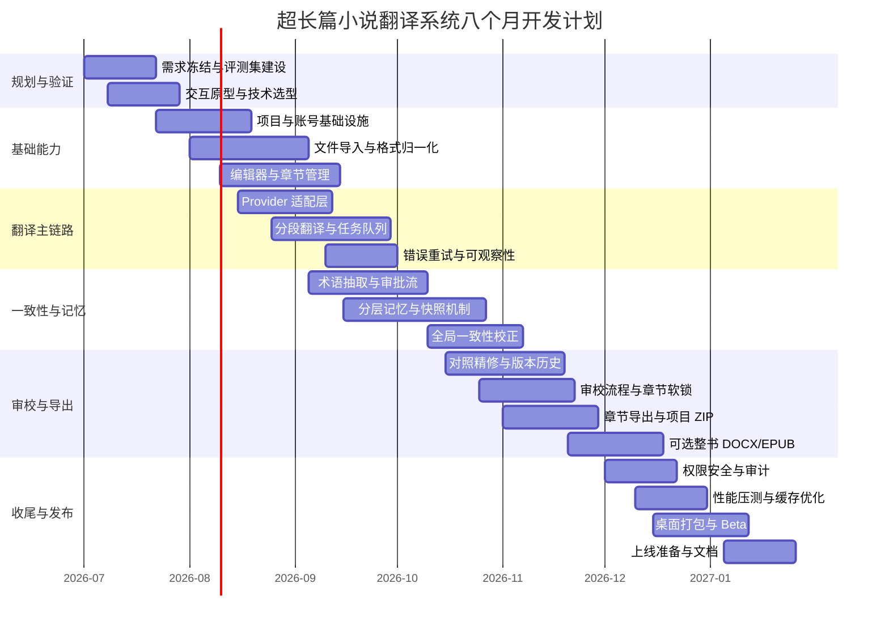

# 超长篇小说翻译系统产品设计与技术方案研究报告

## 执行摘要

面向“从一话到数百话”的超长篇小说翻译场景，最优默认路线不是纯 Web，也不是纯本地桌面，而是**桌面优先的混合架构**：用 **Tauri 桌面客户端**承担本地目录访问、批量导入、离线缓存、原文/译文对照编辑与精修；用**云端服务**承担翻译编排、术语表与上下文记忆、任务队列、导出与可选协作；同时保留**纯本地模式**作为高隐私备选，以及**轻量 Web 门户**作为跨设备查看与审校入口。原因很直接：浏览器文件能力必须建立在用户显式授权的文件/目录句柄之上，而桌面端可以通过系统级文件对话框和受控权限完成更自然的目录级导入；Tauri 又利用系统原生 WebView，官方给出的应用体积可小到约 600KB，比 Electron 的“内嵌 Chromium + Node.js”模式更轻。 citeturn11search0turn11search3turn12search0turn13search3turn33search2turn33search9turn12search3

模型接入层应采用**双通道适配**：一条是**原生 Provider 适配器**，对接 OpenAI、Anthropic、Azure OpenAI/Microsoft Foundry 等正式 API；另一条是**OpenAI-compatible 适配器**，统一接入 vLLM、Ollama、llama.cpp 等本地或自托管推理服务。这样既能利用 GPT-4.1 一类的 1M 上下文商用模型，也能接入 Llama 3.1 的 128k 上下文开源模型、Mistral Small 4 / Large 3 的 256k 上下文模型，并避免后续产品被单一供应商锁死。vLLM、Ollama、llama.cpp 都提供了不同程度的 OpenAI 兼容接口，因此这层抽象可以显著降低后端复杂度。 citeturn45search0turn47search1turn36search4turn36search1turn32view1turn31view1turn31view2turn41search10turn31view3turn31view4

长篇一致性不能只依赖“大上下文窗口”。虽然 GPT-4.1 与 Claude Sonnet 4.6 都已经提供 1M 级上下文，而部分 Mistral 模型也达到 256k，但文档级机器翻译研究与术语一致性研究都说明：**最可控的工程化方案**仍然是“**分段翻译 + 术语表 + 分层记忆检索 + 全局一致性校正**”。滑动窗口只适合作为局部上下文基元；RAG 更适合召回人物设定、地名、前情摘要和风格规则；真正决定长篇可维护性的，是术语与风格的显式管理、阶段性上下文快照，以及事后的全局一致性修补。 citeturn45search0turn47search1turn18search1turn18search9turn18search5turn19search0turn18search0

并发处理可以做，但不能让每个 worker 同时改写全书记忆。推荐采用**“快照化上下文 + 波次并发 + 全局校正”**：先生成书级、卷级、章节级摘要快照，再允许同一波次章节共享同一快照并行翻译；翻译完成后运行一致性检查与修补建议，审核通过后再晋升为下一版快照。这一方式能兼容 vLLM 的高吞吐与前缀缓存能力，也能配合 OpenAI / Anthropic 的 Prompt Caching 与 Batch API 降低长篇重复前缀带来的时延和成本。 citeturn10search0turn10search1turn41search12turn39view1turn39view2turn40view0turn40view1

在开发节奏上，我建议以**8 个月**为主计划：**前 3 个月做到可批量导入、可翻译、可编辑、可导出章节**；第 4 到 6 个月完成**术语表、分层记忆、全局一致性校正、审校流**；第 7 到 8 个月补齐**桌面打包、权限、安全、性能、整书导出与 Beta**。若团队更小，应把“实时多人协作”和“复杂整书排版合并”延后到第二阶段。 citeturn14search0turn14search5turn19search3turn19search2turn15search3turn15search2

| 关键决策 | 主方案 | 备选方案 A | 备选方案 B | 结论 |
|---|---|---|---|---|
| 产品形态 | **混合架构**：Tauri 桌面 + 云端服务 + 可选 Web 门户 | 纯 Web SaaS | 纯桌面/纯本地部署 | 主推混合；兼顾本地文件、隐私、扩展性 |
| 模型接入 | **原生 Provider + OpenAI-compatible 双通道** | 仅原生 Provider 适配 | 仅本地/自托管模型 | 主推双通道；最抗供应商锁定 |
| 长文本策略 | **分段翻译 + 术语表 + 分层记忆 + 全局校正** | 超长上下文整章/整卷直送 | 滑动窗口 + 人工维护术语 | 主推组合式，不建议单招吃满场景 |
| 存储 | **PostgreSQL + pgvector + 对象存储** | PostgreSQL + Milvus | 纯本地 SQLite + 文件系统 | 初创团队先一库优先，后续再拆 |
| 协作 | **单用户优先 + 章节级审校/软锁 + 版本历史** | 多人章节锁 | Yjs/CRDT 实时协作 | MVP 不做实时 CRDT，留作企业版 |
| 导出 | **章节导出优先，整书导出可选** | DOCX/EPUB 整书构建 | XLIFF/TBX 交换优先 | MVP 先把导出做稳，再上整书合并 |

上表的主备选判断，主要依据浏览器与桌面端的文件访问模型、Tauri/Electron 的运行与安全模型、OpenAI/Anthropic/Azure 与开源推理框架的接入方式，以及文档级翻译与术语一致性研究的工程含义。 citeturn11search0turn12search3turn33search2turn33search9turn45search0turn47search1turn37view0turn41search10turn18search1turn18search5turn19search0

## 需求边界与假设

本报告以你给出的已知需求为固定边界：支持任意第三方模型 API 或本地模型、可配置提示词、自动术语表与上下文记忆、批量上传或读取本地文件、原译文对照编辑、导出为主且整书合并可选、并发处理需要评估一致性影响。

未指定的信息，以下采用工程假设处理：

| 假设项 | 本报告采用值 |
|---|---|
| 团队类型 | 中小型 SaaS 初创团队 |
| 预算 | 先做可卖/可用，不以大规模自建 GPU 集群为前提 |
| 目标用户 | 独立译者、小型翻译工作室、轻量企业私有部署客户 |
| 目标语言对 | 以中英为主示例；架构不绑定语言对 |
| 首发优先级 | 导入稳定性、翻译一致性、术语与记忆、人工精修、章节导出 |
| 可延期功能 | 实时多人协作、复杂整书排版、移动端全功能创作 |

在这样的假设下，平台的首要 KPI 不应是“单次模型分数最高”，而应是：**长篇一致性、术语命中率、人工后编辑成本、批量吞吐、导出稳定性和隐私控制能力**。对于小说场景，还应单列“人物名一致性”“敬语/语体一致性”“世界观术语一致性”“段落断行保持率”和“后编辑距离”作为评估指标。这些指标不依赖单一模型，而依赖整个工作流设计是否正确。

## 产品形态与总体架构推荐

### 架构选项比较

从用户需求看，“可直接读取本地文件/目录”“大量章节导入”“对照精修”“导出”和“并发任务”这些点天然指向**桌面优先**，但“模型编排、协作、审校、访问控制、运营”又天然适合上云。因此产品形态需要先做取舍，而不是先做页面。浏览器只能在用户授权前提下访问文件和目录；Electron 可以通过原生对话框和 Node/IPC 获取文件路径；Tauri 也提供原生文件对话框与文件系统插件，并采用能力边界（capabilities）控制授权范围；Tauri 的移动插件文档还明确说明 iOS/Android 目录选择器能力有限，不适合作为重度创作主载体。 citeturn11search0turn11search3turn12search0turn12search6turn13search2turn13search3turn13search5

| 架构选项 | 优点 | 缺点 | 适用场景 | 对隐私影响 | 对性能影响 | 对成本影响 | 对可扩展性影响 | 结论 |
|---|---|---|---|---|---|---|---|---|
| 云端 Web 应用 | 上手门槛低；部署快；方便账号体系与协作 | 本地目录访问受限；大批量导入/断点续传体验一般；离线能力弱 | 试玩版、轻审校、纯上传工作流 | 中等；文件进云默认更多 | 中等；依赖网络 | 前端低、后端高 | 高 | 可做辅助入口，不宜做主创作端 |
| 桌面客户端 | 本地目录访问强；离线能力强；适合大批量导入与重度编辑 | 更新、签名、分发复杂；云协作需额外设计 | 独立译者、私有部署 | 高；可提供纯本地模式 | 高；本地 I/O 好 | 客户端维护成本较高 | 中等 | 很适合重度用户 |
| 混合架构 | 兼顾本地导入与云编排；隐私模式灵活；适合长期产品化 | 架构复杂度最高；需要明确本地/云边界 | 最广泛；首发也最稳妥 | 高，可做本地优先/云增强 | 高；可异步批处理 | 中等 | 高 | **最推荐** |
| 移动端 | 便于碎片化查看和微调 | 大文件和目录管理差；编辑效率差；系统文件权限更碎片化 | 审校、批注、查看 | 中等 | 低到中等 | 双端开发成本高 | 中等 | 不应做主产品，仅做审校 companion app |

该表的事实基础包括：MDN 对浏览器文件/目录授权模型的说明，Electron 的原生对话框与 IPC 模式，Tauri 的文件系统和能力控制，以及 Tauri 移动端对文件夹选择器的限制。至于“适不适合做主产品”，则是基于这些能力边界做出的工程判断。 citeturn11search0turn11search3turn12search0turn12search6turn13search0turn13search3turn13search5

### 主推荐形态与技术栈

**主方案：Tauri 桌面客户端 + 云端编排服务 + 可选 Web 门户。**

推荐原因有三层：

其一，**本地目录访问与批量导入**是小说翻译的刚需，不应强迫用户把数百个章节逐个上传。Tauri 的原生对话框和文件系统能力，明显比浏览器 File API 更适合目录级选择与断点导入。 citeturn13search3turn13search5turn11search0

其二，**桌面精修体验**对产出质量有决定性影响。小说翻译不是聊天框输出，而是“原文—译文—术语—注释—历史版本”并排工作台。桌面端可提供更稳定的长文编辑器、快捷键、局部缓存和导出。Electron 也能实现，但 Tauri 在体积和权限模型上更适合作为首选；Electron 则是成熟生态备选。 citeturn33search2turn33search9turn12search3

其三，**云端编排**仍然必要。多模型路由、任务队列、项目与术语存储、导出生成、团队协作、审计日志，这些都更适合放在服务端。换句话说，桌面端负责“用户交互与本地文件”，云端负责“重任务编排与多用户治理”。 citeturn41search10turn18search2turn14search2

推荐的最小技术栈如下：

| 层 | 主方案 | 备选 |
|---|---|---|
| 桌面前端 | Tauri 2 + React + TypeScript + TipTap/ProseMirror | Electron + React |
| API 层 | FastAPI | NestJS / Go |
| 翻译 Worker | Python Worker + Redis 队列 | Temporal / RabbitMQ |
| 主数据库 | PostgreSQL | MySQL |
| 向量检索 | pgvector | Milvus |
| 对象存储 | S3 兼容对象存储 | Azure Blob / GCS |
| 权限控制 | Postgres RLS + 应用层 RBAC | 单纯应用层 RBAC |
| 监控 | OpenTelemetry + Prometheus + Grafana | 各云原生 APM |

这里把 **PostgreSQL + pgvector** 作为首选，是因为 pgvector 可以把向量与业务数据放在同一数据库里，支持 ACID、JOIN 和近邻搜索；对初创团队来说，维护成本远低于一开始就引入独立向量数据库。Milvus 更适合在向量规模、检索压力和独立集群能力上再上一个量级时再拆出去。 citeturn18search2turn18search6turn18search3

### 本地读取方案比较

| 本地读取方案 | 能力边界 | 用户体验 | 安全性 | 适合程度 |
|---|---|---|---|---|
| 浏览器文件上传 | 只能读取用户显式选择的文件；更适合文件而非目录批量工作流 | 一般 | 高 | 适合作为保底入口 |
| Browser File System Access API | 可在用户授权后访问目录与写回，但依赖浏览器支持与 HTTPS 安全上下文 | 中等 | 高 | 可做 Web 增强功能，不应成为唯一方案 |
| 桌面客户端原生目录选择 | 原生对话框、目录级选择、后续缓存路径与批量处理更自然 | 最好 | 取决于权限与沙箱设计 | **最适合主工作流** |

MDN 明确说明浏览器侧的文件系统访问建立在句柄与用户授权之上；Electron 与 Tauri 则通过原生对话框和受控权限完成桌面式文件操作。对于重度小说场景，桌面目录选择是体验上最自然的主工作流。 citeturn11search0turn11search3turn12search0turn12search6turn13search3turn13search5

## 模型接入与长文本翻译方案

### 模型接入策略比较

“支持任意第三方模型 API 或本地模型”这一需求，本质上要求后端不要把 Provider、协议、价格策略和上下文记忆写死在流程里。架构上应把“翻译请求”抽象成统一的 `TranslateSegmentRequest`，再由不同 Provider Adapter 去做参数映射。OpenAI 与 Azure OpenAI/Microsoft Foundry 都支持标准推理 API；Anthropic 走 Messages API；vLLM、Ollama 和 llama.cpp 则可通过 OpenAI-compatible 接口纳入同一调用平面。 citeturn36search4turn36search6turn38view0turn41search10turn31view3turn31view4

| 模型接入策略 | 代表实现 | 延迟 | 成本 | 隐私 | 上下文窗口 | 长文本处理能力 | 可定制性 | 运维复杂度 | 建议 |
|---|---|---|---|---|---|---|---|---|---|
| 第三方 API | OpenAI、Anthropic、Azure OpenAI/Microsoft Foundry、Mistral API | 中等到低；取决于网络和服务等级 | 按 token 计费，前期弹性最好 | 中到高；取决于供应商与合规设置 | 最高可到 1M 级别 | 很强，适合高质量主翻与全局校正 | 中等 | 低 | **MVP 首选** |
| 自托管大模型 | vLLM + Llama 3.1 / Mistral open-weight；本地 Ollama / llama.cpp | 本地低，云内较低 | 低边际、高固定成本 | 最高 | 多在 128k–256k 级 | 强，但取决于模型质量与显存 | 高 | 高 | 用于私有化、成本优化和离线模式 |
| 本地小模型 + 远程大模型混合 | 本地 8B/14B 做预处理，远程 GPT/Claude 做主翻与校正 | 体验最佳之一 | 综合成本最低且灵活 | 高，可对敏感内容先本地处理 | 取决于远程主模型 | 最均衡 | 最高 | 中等 | **长期最佳形态** |

这一比较的关键事实基础是：GPT-4.1 提供约 1.05M 上下文、标价 $2/$8 每百万输入/输出 tokens，GPT-4.1 mini 是 $0.4/$1.6；Claude Sonnet 4.6 提供 1M 上下文 beta，价格延续 $3/$15；Mistral Large 3 与 Mistral Small 4 均为 256k 上下文，价格分别约 $0.5/$1.5 与 $0.15/$0.6；Meta Llama 3.1 官方模型卡给出 128k 上下文。Azure OpenAI/Microsoft Foundry 则把模型托管在 Azure 环境里，由微软计费与支持，适合把合规性放在首位的客户。 citeturn45search0turn46view0turn47search1turn31view1turn31view2turn32view1turn36search1turn37view0

**主推荐**是：**“远程高质量模型 + 本地/自托管补位”的混合路由**。也就是：

- **主翻模型**：OpenAI GPT-4.1 或 Claude Sonnet 4.6 这类长上下文、高指令遵循模型；
- **预算模型**：GPT-4.1 mini 或 Mistral Small 4 处理术语候选、摘要、轻校验；
- **本地模型**：Ollama / llama.cpp 运行 8B–14B 级模型承担离线预处理、OCR 后清洗、术语候选初筛与超敏感文本的本地模式。 citeturn45search0turn46view0turn47search1turn31view2turn31view3turn31view4

如果一定要把题目里的 **Llama 2** 纳入路线图，我的建议是：**仅把它看作“可接入类别”的代表，不要把它作为 2026 年新项目的主力模型**。原因不是它不能接，而是其代际能力与上下文能力已经明显落后于 Llama 3.1 和当前 Mistral 系模型。 citeturn42search2turn32view1turn31view1

### 长文本与上下文记忆方案比较

文档级翻译与词汇一致性研究显示，长文场景的收益来自**显式文档上下文建模**，而不是简单把更多 token 塞进提示词。RAG 论文提供了“参数记忆 + 非参数记忆”的组合框架；机器翻译研究则证明文档级上下文和词汇一致性控制能带来实际改进。把这些思想工程化后，最合理的设计是分层记忆，不是单一招数。 citeturn18search0turn18search1turn18search9turn18search5turn19search0

| 方案 | 翻译质量 | 一致性 | 并发友好度 | 实现复杂度 | 适合角色 | 建议 |
|---|---:|---:|---:|---:|---|---|
| 整卷/整本超长上下文直送 | 3 | 3 | 1 | 2 | 原型验证 | 不作为主线 |
| 滑动窗口 | 3 | 2.5 | 4 | 2 | 局部上下文基元 | 必要，但只能打底 |
| 纯 RAG / 向量召回 | 3.5 | 3 | 4 | 3 | 设定召回、前情提要 | 只能做辅助手段 |
| 分段翻译 + 术语表 + 全局一致性校正 | 4.5 | 4.5 | 4 | 4 | 正式生产主流程 | **主推** |
| 分层长期记忆库 | 4.5 | 4.5 | 5 | 4.5 | 长篇项目/多卷续作 | **必须与主流程结合** |

**评分结论**很明确：  
最佳实践不是“在这些方案里四选一”，而是：

**滑动窗口**作为局部上下文基础；  
**RAG/记忆库**负责召回人物、地名、世界观、前情摘要与风格规则；  
**术语表和风格指南**负责显式约束；  
**全局一致性校正**负责把并发翻译后的偏差再拉回统一。 citeturn18search0turn18search1turn18search5turn19search0turn18search2

### 推荐的翻译流水线

下面这条流水线，是我认为在质量、成本、并发和可维护性之间最平衡的实现：



这条流水线背后的工程逻辑，是把“知识”和“翻译”分开：知识层包括术语、人物、组织、地点、世界观规则、叙事视角、口吻策略；翻译层只消费这些经过版本化的约束与摘要。这样做，才能把并发翻译从“每段都重新发明世界观”变成“在既定世界观内作业”。文档级上下文研究、术语约束研究和 RAG 的外部记忆思路，都支持这种分层做法。 citeturn18search1turn18search5turn19search0turn18search0

### 并发处理对一致性的影响与解决方案

你的需求特意点到了“并发处理可选，需评估对上下文记忆的影响”。这里要明确：**并发本身不是问题，问题是并发写入全局记忆**。

推荐的解决方案是**“快照化上下文”**：

- **书级快照**：人物表、地名表、世界观术语、风格指南、敏感禁译表；
- **卷级快照**：卷内剧情摘要、当前人物关系、卷内新增术语；
- **章节级摘要**：上一章摘要、当前章目标风格、未解决指代链。  

执行时，worker 只读快照，不直接改“主记忆”；翻译完成后，把新术语候选、冲突项和摘要增量写入待审区，由一致性校正器和人工一起决定是否晋升。这样，**同一波次章节可以并发**，而全书规则仍然是串行演进的。vLLM 的高吞吐与前缀缓存，以及 OpenAI/Anthropic 的 Prompt Caching，都非常适合这种“同前缀、多变体”的请求模式。 citeturn10search0turn10search1turn39view1turn40view1

### 示例 API 调用流程

下面给出一个建议的调用过程：

1. 客户端把章节文本、项目配置、当前快照版本发到后端。  
2. 后端根据项目策略生成统一 `TranslateSegmentRequest`。  
3. 路由器按规则选模型：本地/远程、预算/高质量、同步/批处理。  
4. Provider Adapter 把统一请求映射到 OpenAI、Anthropic、Azure 或 OpenAI-compatible 本地端点。  
5. 返回结果后，后端做 JSON 校验、术语命中检查、冲突比对、持久化，再通知前端刷新。  

这一层的价值在于：**接口稳定，模型可替换**。尤其是 vLLM、Ollama、llama.cpp 都支持 OpenAI-compatible 访问时，可以让大量本地/私有部署能力“长得像”同一种 Provider。 citeturn41search10turn41search2turn31view3turn31view4turn36search4turn38view0

```python
import json
from openai import OpenAI

def translate_segment_openai_compatible(
    base_url: str,
    api_key: str,
    model: str,
    system_prompt: str,
    task_payload: dict,
) -> dict:
    client = OpenAI(base_url=base_url, api_key=api_key)

    resp = client.chat.completions.create(
        model=model,
        temperature=0.2,
        messages=[
            {"role": "system", "content": system_prompt},
            {
                "role": "user",
                "content": json.dumps(task_payload, ensure_ascii=False),
            },
        ],
    )

    # 生产中建议加：schema 校验、自动重试、术语命中检查
    return {
        "raw_text": resp.choices[0].message.content,
        "model": model,
    }
```

这段代码可以直接对接 OpenAI，也可以通过修改 `base_url` 对接 vLLM、Ollama 或 llama.cpp 的 OpenAI-compatible 服务；Anthropic 则保留一个独立的 `messages.create()` 适配器即可。对生产系统来说，真正重要的不是 SDK 细节，而是**统一的任务 schema、可观测性、失败重试和输出验证**。 citeturn41search10turn31view3turn31view4turn38view0

## 术语表文件处理与编辑协作

### 术语表与风格指南管理

术语表不应只是一个“词典表”，而应是一个**版本化的项目知识库**。词汇一致性研究表明，强制术语约束是有效的，但也要避免把所有重复词都机械地翻成同一个目标词；因此系统里需要同时支持“强约束术语”“软建议术语”和“按作用域生效的风格规则”。TBX 是术语交换国际标准；XLIFF 是本地化交换标准；SDLXLIFF 是 Trados 的双语专有变体，适合作为交换格式而不适合作为系统主存格式。 citeturn18search5turn19search0turn34search1turn34search11turn19search3turn19search2

| 维度 | 主方案 | 备选方案 | 设计建议 |
|---|---|---|---|
| 自动提取方法 | 频次统计 + 规则 + NER + 重复跨度检测 | 纯大模型抽取 | 主方案更稳，可解释，可做增量更新 |
| 人工校正流程 | 待审队列 + 冲突候选 + 一键批准/驳回 | 直接在表格里手改 | 审批流更适合长篇项目 |
| 版本控制 | `draft / approved / deprecated` + 生效版本号 | 仅覆盖写入 | 必须保留历史，支持回滚 |
| 生效范围 | segment / chapter / volume / book / project | 全局唯一生效 | 作用域必须可控 |
| 导入导出 | CSV、JSON、TBX | 仅 CSV | JSON 适合系统内部；TBX 适合交换 |
| CAT 互通 | XLIFF、SDLXLIFF 可选导入/导出 | 完全不支持 | 建议做“可选交换层”，不是主数据层 |

我的主张是：**系统内部统一存 JSON/关系表，外部交换时再导出 CSV/TBX/XLIFF/SDLXLIFF**。原因是内部数据结构需要包含来源、别名、作用域、置信度、审批状态、说明、更新时间和冲突记录；而交换格式强调的是互操作，不一定适合作为运行时主表。 citeturn34search1turn34search11turn19search3turn19search2

一个推荐的术语表 JSON 可以长这样：

```json
{
  "project_id": "novel_001",
  "version": "2026-06-15T10:00:00Z",
  "source_lang": "en",
  "target_lang": "zh-CN",
  "terms": [
    {
      "id": "term_001",
      "source": "Aether Gate",
      "target": "以太之门",
      "aliases": ["以太门"],
      "scope": "book",
      "status": "approved",
      "constraint": "hard",
      "notes": "正式设定词，不使用“天穹之门”"
    },
    {
      "id": "term_002",
      "source": "Watcher",
      "target": "守望者",
      "aliases": ["观察者"],
      "scope": "volume",
      "status": "approved",
      "constraint": "soft",
      "notes": "叙事中可按语气酌情变化"
    }
  ],
  "style_guide": {
    "register": "web_novel_literary",
    "pov": "third_person_limited",
    "dialogue_policy": "natural_cn",
    "line_break_policy": "preserve"
  }
}
```

这里最关键的不是 JSON 长什么样，而是它要支持：**作用域、状态、硬软约束、别名、说明、版本**。这样后续校正器才知道哪些词必须统一，哪些词只能提示。对于小说来说，这比单纯的“源词→目标词”更接近实际。 

### 文件输入输出与合并策略

文件支持上，不建议一开始就承诺“什么都完美支持”。更稳妥的路线是把格式分为三层：**原生高优先级格式**、**通过转换层支持的格式**、**首版限制支持的格式**。Calibre 的 `ebook-convert` 能覆盖大量电子书格式转换；EbookLib 可读写 EPUB；python-docx 可读写 DOCX；PyMuPDF 适合 PDF 文本提取；图片型 PDF 则需要 OCR，Tesseract 与 PaddleOCR 都可作为补位。 citeturn15search0turn15search3turn15search2turn15search1turn16search0turn16search1turn16search2

| 格式 | 导入优先级 | 解析稳定性 | 导出建议 | 风险点 | 建议 |
|---|---|---|---|---|---|
| TXT / MD | 高 | 最高 | 高 | 结构信息少 | 首发必须支持 |
| DOCX | 高 | 高 | 高 | 样式继承复杂 | 首发必须支持 |
| EPUB | 高 | 高 | 高 | TOC / spine / metadata 需处理 | 首发建议支持 |
| MOBI / AZW3 | 中 | 中 | 低到中 | 通常需先转 EPUB | 借助 Calibre 转换 |
| PDF 文本型 | 中 | 中 | 低 | 断行、页眉页脚、顺序混乱 | 首版只做“尽力提取” |
| PDF 扫描型 | 低 | 低 | 低 | 需 OCR；成本与噪音高 | 首版可不内建，提示转 OCR 后再导入 |

这张表的事实依据主要来自 Calibre、EbookLib、python-docx 和 PyMuPDF 的官方能力边界，以及 Tesseract/PaddleOCR 对图像和 PDF OCR 的定位。对 PDF 的“风险高”判断，则是工程事实和经验共同作用的结果。 citeturn15search0turn15search3turn15search2turn15search1turn16search0turn16search1turn16search2

我建议的 I/O 策略如下：

- **MVP 导入**：TXT、MD、DOCX、EPUB；  
- **MVP 导出**：TXT、DOCX、EPUB、项目 ZIP；  
- **Phase 2 导入**：MOBI/AZW3 通过 Calibre 转 EPUB；  
- **Phase 2 导入**：PDF 文本提取；  
- **Phase 2 导出**：XLIFF / SDLXLIFF / TBX 交换。  

整书合并方面，建议把“**章节导出一定可用**”作为首要目标，把“**整书构建**”作为可选增强。整书构建的正确做法不是把文本简单拼接，而是先维护一个**manifest**：卷顺序、章顺序、标题层级、插图、分隔页、前言、后记、版权页、目录策略，然后再分别渲染为 DOCX 或 EPUB。对首版来说，如果资源有限，完全可以只交付“章节导出 + 项目 ZIP + 按顺序批量导出”。这是符合需求、也最稳妥的取舍。 citeturn15search3turn15search2turn15search0

### 用户编辑与协作工作流

对创作类产品来说，“多人协作”是典型的高诱惑、高复杂度功能。Yjs 明确面向协作应用并采用 CRDT 合并；ProseMirror 本身也有成熟的协作编辑基础；但这并不意味着首版就应该上实时 CRDT。对于小说翻译，很多用户其实只需要“**我翻你审**”而不是“**多人同时打同一段字**”。 citeturn14search0turn14search5turn14search1

| 工作流选项 | 冲突解决 | 审校流程 | 权限与历史 | 实现复杂度 | 推荐 |
|---|---|---|---|---|---|
| 单用户 + 自动版本历史 | 无冲突 | 自审 | 最简单 | 低 | 基础必做 |
| 多人章节级软锁 / ETag 合并 | 粗粒度冲突少 | 译者→审校→定稿 | 清晰 | 中 | **MVP 推荐** |
| 实时多人协作 CRDT | 自动合并局部冲突 | 实时协同 | 最强 | 高 | 第二阶段再做 |

我的建议非常明确：

- **首版**：单用户编辑 + 审校角色 + 章节级软锁 + 历史版本；  
- **第二阶段**：多用户章节并行处理；  
- **企业版/工作室版**：若确有强需求，再引入 Yjs 实时协作。  

后端权限建议用 **RBAC + Postgres Row-Level Security** 做项目隔离；二进制导出和构建结果则建议放对象存储，并开启版本控制，用于恢复误覆盖。 citeturn14search2turn14search3

示例的分段翻译任务数据，可以设计成下面这样：

```json
{
  "project_id": "novel_001",
  "chapter_id": "ch_012",
  "segment_id": "seg_034",
  "snapshot_version": "book_v7",
  "source_text": "He pushed the Aether Gate open and looked back at Evelyn.",
  "local_context": {
    "prev": "The corridor was silent.",
    "next": "No one answered."
  },
  "glossary_terms": [
    {"source": "Aether Gate", "target": "以太之门", "constraint": "hard"},
    {"source": "Evelyn", "target": "伊芙琳", "constraint": "hard"}
  ],
  "style_guide": {
    "register": "web_novel_literary",
    "line_break_policy": "preserve",
    "dialogue_policy": "natural_cn"
  },
  "memory_hits": [
    {
      "type": "chapter_summary",
      "content": "本章主氛围偏压抑，人物关系紧张。"
    }
  ]
}
```

对应的响应则建议同时返回直译结果、潜在新术语和一致性警告，而不是只返回一段裸文本：

```json
{
  "translation": "他推开以太之门，回头看向伊芙琳。",
  "new_term_candidates": [],
  "consistency_warnings": [],
  "summary_delta": "角色进入关键地点并与伊芙琳形成对视。"
}
```

这种结构化响应有两个好处：一是方便后端做自动校验和追踪；二是方便前端在编辑器边栏里直接显示“术语命中”“冲突提醒”和“记忆增量”。如果 Provider 支持结构化输出，优先启用；如果不支持，就在应用层强制做 JSON 校验和失败重试。 

## 成本扩展性与安全设计

### 成本模型与可扩展性估算

为了给出可操作的估算，下面采用一个明确假设：

**单个长篇项目 = 100 万输入 tokens + 30 万输出 tokens。**  
这是一个工程估算样本，用于比较不同模型的量级，不代表所有小说都会正好落在这个数字上。实际项目中，提示词、记忆召回、校正轮次与缓存命中率会显著影响最终账单。

在这个假设下，公开价格可直接算出如下水平：

| 路线 | 官方单价 | 单项目估算 | 50 个项目/月 | 200 个项目/月 | 备注 |
|---|---|---:|---:|---:|---|
| OpenAI GPT-4.1 | $2 / MTok 输入；$8 / MTok 输出 | **约 $4.4** | 约 $220 | 约 $880 | 高质量主翻/校正 |
| OpenAI GPT-4.1 mini | $0.4 / MTok 输入；$1.6 / MTok 输出 | **约 $0.88** | 约 $44 | 约 $176 | 预算路由、摘要、校验 |
| Anthropic Claude Sonnet 4.6 | $3 / MTok 输入；$15 / MTok 输出 | **约 $7.5** | 约 $375 | 约 $1,500 | 高质量、长上下文 |
| Mistral Small 4 | $0.15 / MTok 输入；$0.6 / MTok 输出 | **约 $0.33** | 约 $16.5 | 约 $66 | 低成本批处理 |
| Mistral Large 3 | $0.5 / MTok 输入；$1.5 / MTok 输出 | **约 $0.95** | 约 $47.5 | 约 $190 | 性价比较高的中高阶 |

以上金额是按官方每百万 tokens 价格直接换算得出；若使用 **OpenAI Batch API**，离线任务可享受约 **50% 成本折扣**，并有更高的批处理配额；Anthropic 的 **Message Batches API** 同样给出 **50% 的标准价折扣**。如果请求前缀高度重复，OpenAI Prompt Caching 还可在长前缀场景下降低输入成本和时延，Anthropic 也提供显式或自动缓存机制。也就是说，**长篇回填、重跑和大规模校正，天然适合异步批处理，而不是同步逐章点按钮**。 citeturn45search0turn46view0turn47search1turn31view1turn31view2turn39view2turn40view0turn39view1turn40view1

### 自托管与硬件建议

对中小团队来说，我不建议一开始就把主翻模型做成大规模自托管集群。更现实的做法是：**API-first 起步，自托管做补位**。当客户出现强隐私或离线诉求时，再逐步引入本地/私有部署模式。

| 部署层级 | 推荐模型级别 | 推荐运行时 | GPU 建议 | 适用场景 | 说明 |
|---|---|---|---|---|---|
| 本地轻量模式 | 8B–14B 量化模型 | Ollama / llama.cpp | 24GB 级 GPU | 个人离线、术语提取、摘要 | 适合本地预处理，不建议承担最终文学定稿 |
| 小型私有部署 | 8B–32B | vLLM | 1× L4 24GB / A10G 24GB | 小团队私有云 | 适合预算和隐私平衡 |
| 中高质量开源部署 | 70B 或更大 / MoE | vLLM 多 GPU | 80GB 级 GPU 或多卡 | 企业涉敏文本 | 运维与成本会明显上升 |
| 公有云 API-first | 商业闭源大模型 + 本地小模型补位 | API + 局部本地 | 无需专属生成 GPU | 初创团队首发 | **最推荐** |

这里的硬件判断基于几条公开事实：AWS G5 的 A10G 每卡 24GB 显存；Google Cloud 的 L4 虚拟工作站公开 GPU 定价约为 **$0.56004024 / 小时 / GPU**；Meta Llama 3.1 的 8B/70B/405B 模型都提供 128k 上下文；vLLM 适合高吞吐在线推理，并用 PagedAttention 和前缀缓存提升长上下文场景的吞吐。单看 GPU 价格，1 张 GCP L4 按 24×30 小时粗算约 **$403/月** 的 GPU-only 成本，还未包含 CPU、内存、网络和存储。也就是说，**自托管要么为了隐私，要么为了规模；很少只是为了省钱**。 citeturn20search0turn25view0turn25view1turn32view1turn10search0turn41search10

如果把“并发场景”进一步落到系统侧，我建议这样规划：

| 并发场景 | 典型配置 | 主翻策略 | 记忆策略 | 建议 |
|---|---|---|---|---|
| 低并发 | 1–5 个项目同时跑 | API 同步或小批量异步 | 书级快照 + 章节摘要 | 最适合首发 |
| 中并发 | 10–20 个项目同时跑 | API 批处理 + 本地缓存 | 书级/卷级快照 + 事后校正 | 主流 SaaS 区间 |
| 高并发 | 50+ 项目同时跑 | 批处理优先 + 自托管补位 | 分层记忆 + 波次并发 | 需要更严格的调度与限流 |

### 安全与隐私

小说文本虽然不像金融或医疗数据那样天然受强监管，但商业化作品、签约稿、未公开章节和世界观设定往往具有明显的版权与保密价值。因此隐私设计不能只是“传输全站 HTTPS”这么简单，而要覆盖：**本地文件访问、文件上传、模型 API 保留策略、对象存储加密、数据库权限、审计与导出留痕**。OpenAI 官方说明 API 数据默认不用于训练；Anthropic 商业产品默认不把输入/输出用于训练；Azure 明确说明 Prompts/Completions 不会提供给模型提供商，也不会在未经许可的情况下用于训练基础模型，但 Azure 仍有内容过滤和滥用监控机制，需要合规客户按文档申请修改监控。 citeturn39view0turn38view1turn37view0

| 风险点 | 风险描述 | 推荐控制 | 是否首版必做 |
|---|---|---|---|
| 本地文件读取 | 目录访问过宽、误读敏感文件 | 只允许用户显式选择目录；最小权限；可见授权范围 | 是 |
| 桌面安全 | 远程内容与本地权限混用 | Tauri 能力白名单；Electron 备选时禁用危险配置，开启 `contextIsolation` | 是 |
| 文件上传 | 恶意文件、伪造类型、超大文件、压缩包炸弹 | 扩展名 allowlist、MIME 与真实类型双验、大小限制、隔离解析、重命名、非 Web 根目录存储 | 是 |
| 模型 API 泄露风险 | 文本进第三方 API；部分功能可能有保留策略 | 提供供应商选项、私有部署模式、合规说明、项目级 Provider 策略 | 是 |
| 对象存储 | 导出稿与中间文件被误删或越权读取 | 默认加密；KMS；版本控制；签名 URL；最小权限 | 是 |
| 数据库访问 | 项目串库、误查他人文本 | Postgres RLS + 应用层 RBAC | 是 |
| 传输加密 | 内网或公网链路泄露 | 全链路 TLS；数据库 SSL/TLS | 是 |
| 审计与回滚 | 误覆盖术语、误删章节、导出错版 | 版本历史、对象存储 versioning、操作审计日志 | 是 |

这里的控制项基本都能从官方文档直接找到依据：Tauri 的 capability 与文件系统权限模型、Electron 的安全指南、OWASP 的文件上传加固建议、S3/KMS 的服务端加密、PostgreSQL 的 TLS 连接和对象版本控制。对 SaaS 产品而言，**“可回滚”几乎和“可加密”一样重要**，因为很多事故不是泄露，而是误删、误覆盖和错误导出。 citeturn13search2turn13search5turn12search3turn35search5turn35search2turn35search0turn35search1turn14search3

安全默认值我建议这样定：

- **默认项目模式**：云端增强模式；  
- **高隐私项目模式**：禁用云端记忆外扩，只允许受控 Provider；  
- **本地私有模式**：Ollama/llama.cpp + 本地存储，不启用云同步；  
- **企业私有部署模式**：vLLM + 受控对象存储 + 企业 SSO + RLS。  

这样产品才不会把“隐私”做成一刀切开关，而是做成符合商业现实的分层策略。

## 开发计划与里程碑

### 分阶段里程碑

以下计划按 **8 个月**设计，适合 4–6 名核心工程成员的中小团队。若团队只有 2–3 个工程师，应删除“实时协作”和“复杂整书构建”，把重点集中在：导入、路由、翻译、术语、记忆、编辑、章节导出。

| 阶段 | 主要交付物 | 主要角色 | 估算工时 | 通过标准 |
|---|---|---|---:|---|
| 需求冻结与原型 | PRD、交互原型、评测集、架构设计 | PM、设计、Tech Lead | 320h | 明确 MVP 边界与评测样本 |
| 基础设施与导入 | 登录/项目、文件导入、章节识别、基础编辑器 | 前端、后端、DevOps | 720h | 可导入 TXT/DOCX/EPUB 并保存项目 |
| 模型路由与分段翻译 | Provider Adapter、任务队列、分段翻译、错误重试 | 后端/NLP、DevOps | 800h | 可稳定跑完长章节翻译 |
| 术语与分层记忆 | 术语抽取、术语审批、快照、记忆检索 | 后端/NLP、前端 | 880h | 长篇一致性可见提升 |
| 精修与审校流 | 原译文对照、批注、版本历史、章节软锁 | 前端、后端 | 640h | 可完成“译者—审校—定稿” |
| 导出与整书构建 | 章节导出、项目 ZIP、DOCX/EPUB、可选整书 manifest | 后端、前端 | 560h | 至少章节导出稳定可用 |
| 安全与 Beta | 权限、审计、可观测、压测、桌面打包、灰度 | DevOps、QA、全体 | 560h | Beta 可部署、可观测、可回滚 |

若要换算成角色投入，比较现实的配置如下：

| 角色 | 建议投入 | 估算总工时 |
|---|---|---:|
| 产品经理 | 0.5 FTE × 8 月 | 640h |
| 技术负责人 | 1 FTE × 8 月 | 1,280h |
| 后端/NLP 工程师 | 1 FTE × 8 月 | 1,280h |
| 前端/桌面工程师 | 1 FTE × 7 月 | 1,120h |
| DevOps/SRE | 0.3 FTE × 6 月 | 288h |
| QA/测试 | 0.5 FTE × 4 月 | 320h |
| 设计师 | 0.2 FTE × 3 月 | 96h |
| 语言质量顾问 | 0.3 FTE × 4 月 | 192h |

### 时间线甘特图



### 关键风险与缓解措施

| 风险 | 表现 | 缓解措施 |
|---|---|---|
| 文件解析不稳定 | EPUB/PDF 导入质量参差不齐 | 首版收敛高优格式；把复杂格式放转换层；对低质量 PDF 明确降级 |
| 并发导致记忆漂移 | 人名、术语、语气在不同章节发散 | 只读快照 + 波次并发 + 全局校正 + 术语审批 |
| 过度依赖单一模型 | 一旦价格或策略变化，产品被动 | 双通道适配；引入 OpenAI-compatible 本地端点 |
| 桌面权限与安全 | 读取目录过宽、打包安全问题 | 最小权限模型；能力白名单；桌面安全审计 |
| 协作范围蔓延 | 团队过早做 CRDT，拖延主线 | MVP 只做章节软锁与审校角色 |
| 成本失控 | 大项目重跑造成 token 爆炸 | Batch、Prompt Caching、预算路由、项目级配额 |
| 导出复杂度高 | 整书构建花太多时间 | 章节导出先行；整书构建后置 |

### 关键参考来源

本报告的核心依据，优先来自官方与原始资料：OpenAI API 文档中的模型页、数据控制、Prompt Caching 与 Batch；Anthropic 的 Sonnet/Opus 产品页、隐私中心、Data Residency、Prompt Caching 与 Message Batches；Microsoft Learn 关于 Azure OpenAI/Microsoft Foundry 的模型、数据隐私与 API；Meta 官方 Llama 3.1 模型卡；Mistral 官方模型卡；vLLM 官方文档与 PagedAttention 论文；MDN、Tauri、Electron 的文件系统与安全文档；OASIS XLIFF、RWS SDLXLIFF、TBX/国标 TBX；pgvector、Yjs、ProseMirror；以及 Calibre、EbookLib、python-docx、PyMuPDF、OWASP、AWS S3/KMS 与 PostgreSQL TLS 文档。 citeturn45search0turn39view0turn39view1turn39view2turn47search1turn38view0turn38view1turn40view0turn40view1turn37view0turn36search4turn36search1turn32view1turn31view1turn31view2turn10search0turn41search10turn11search0turn13search2turn12search3turn19search3turn19search2turn34search1turn34search11turn18search2turn14search0turn14search5turn15search0turn15search3turn15search2turn15search1turn35search5turn35search0turn35search1

综合来看，**最佳实现建议**可以浓缩成一句话：

**做一个“桌面优先、云端增强、模型可插拔、记忆显式化、导出优先于整书合并”的混合系统；先把长篇一致性和人工精修效率做对，再逐步补齐协作与复杂排版。**

对于你给出的需求集合，这条路线在**体验、实现风险、交付周期、隐私、成本和可扩展性**之间，是当前最稳妥也最接近“可落地最优”的方案。